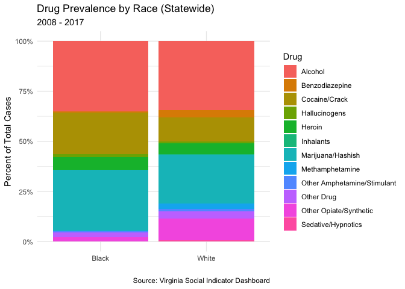
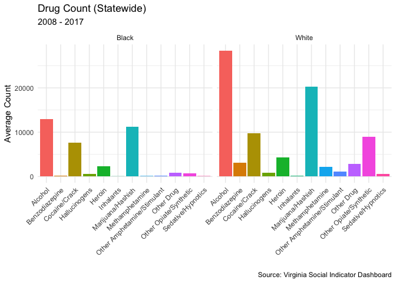
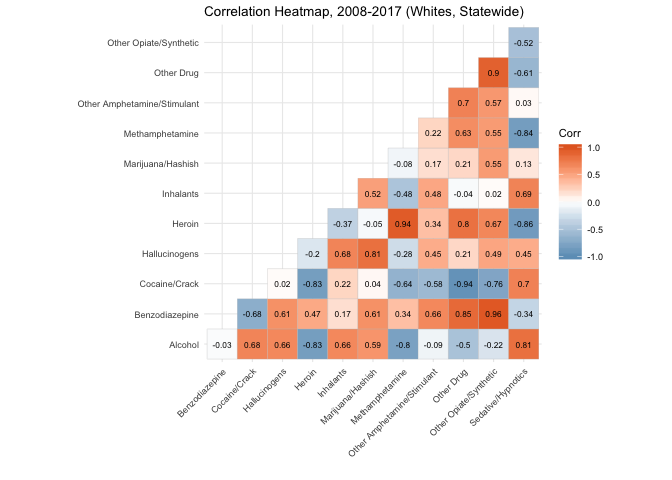
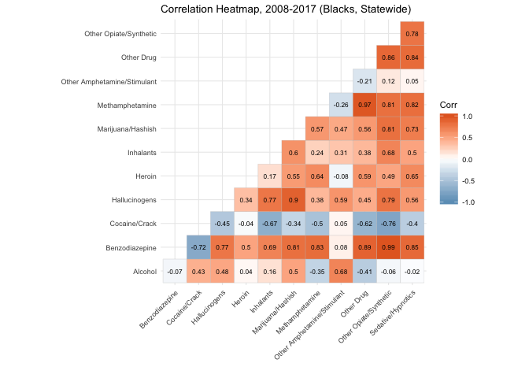
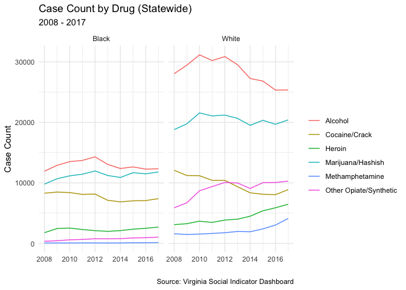
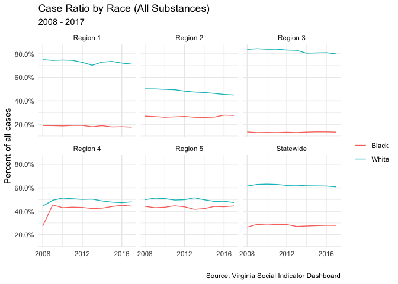
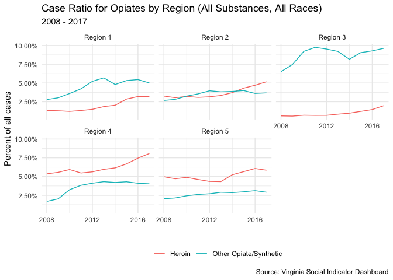

Data Analysis
================
Isaac Radner
May 6, 2019

    ## ── Attaching packages ────────────────────────────────────────────────────────── tidyverse 1.2.1 ──

    ## ✔ ggplot2 3.1.0       ✔ purrr   0.3.2  
    ## ✔ tibble  2.1.1       ✔ dplyr   0.8.0.1
    ## ✔ tidyr   0.8.3       ✔ stringr 1.4.0  
    ## ✔ readr   1.3.1       ✔ forcats 0.4.0

    ## ── Conflicts ───────────────────────────────────────────────────────────── tidyverse_conflicts() ──
    ## ✖ dplyr::filter() masks stats::filter()
    ## ✖ dplyr::lag()    masks stats::lag()

    ## 
    ## Attaching package: 'kableExtra'

    ## The following object is masked from 'package:dplyr':
    ## 
    ##     group_rows

Import Data
-----------

Data Analysis - Virginia DBHDS Case Data
========================================

The below data analysis explores Behavioral Health Service data from the Virginia Department of Behavioral Health & Developmental Services. This data tracks use statistics for mental health and substance abuse services across the state. For the purpose of this anaylsis we will be aggregating the data for both mental health and substance abuse services (note: there is some chance that some individual's data may be duplicated if they received both types of services and/or received multiple episodes of care). We will be exploring both regional-level (Virginia is divided into 5 geographic regions) and state-level data.

The analysis will examine the variation across drug-type (for which a person is receiving treatment) and race.

The above graph, which shows the statewide average count (as a percentage of total count) of cases across drug-types for both Whites and Blacks (for all programs across all years for which there is data) shows many similarities about the prevalence of certain drug-types across the two races and several important differences. *Alcohol*, *heroin*, and *marijuana/hashish* all make up a relatively similar percent of cases across the two races. However, cases involving *benzodiazepines* and *other opiate/synthetic* are more prevalent among Whites while cases involving *cocaine / crack* use are slightly more prevalent among Blacks.

The below graph, which displays the average counts for each drug across race, confirms the above information. It is important to note that the counts for most drugs for Whites are higher than those for Blacks because, in most of Virginia, Whites make up more of the population and a higher percentage of the users of the state's behavioral health programs. This is why looking at the proportional rate of cases for each drug, as in the graph above, is slightly more useful for the present analysis.

It is worth pointing out that the higher rate of behavioral health cases involving *other opiate / synthetic* for Whites probably reflects a higher use-rate of that class of drugs among Whites across the state of Virginia. Other data sources also suggest this conclusion. For example, the Kaiser Family Foundation, which tracks data on opioid-overdoses for each state, reports a higher overdose rate for Whites than other races in Virginia (source: <https://www.kff.org/other/state-indicator/opioid-overdose-deaths-by-raceethnicity/>).

Additionally, it might be the case that variances in case rate across drugs might be causally related. For example, is the higher prevalence of cases for *benzodiazepine* and *other opiate / synthetic* use among Whites connected? We can begin to examine this question by looking at the correlation between the rates of drug prevalence between the various drug categories. The below table displays this correlation matrix for Whites.

<table>
<caption>
Correlation Coefficient Matrix 2008-2017, (Statewide, White)
</caption>
<thead>
<tr>
<th style="text-align:left;">
</th>
<th style="text-align:right;">
Alcohol
</th>
<th style="text-align:right;">
Benzodiazepine
</th>
<th style="text-align:right;">
Cocaine/Crack
</th>
<th style="text-align:right;">
Hallucinogens
</th>
<th style="text-align:right;">
Heroin
</th>
<th style="text-align:right;">
Inhalants
</th>
<th style="text-align:right;">
Marijuana/Hashish
</th>
<th style="text-align:right;">
Methamphetamine
</th>
<th style="text-align:right;">
Other Amphetamine/Stimulant
</th>
<th style="text-align:right;">
Other Drug
</th>
<th style="text-align:right;">
Other Opiate/Synthetic
</th>
<th style="text-align:right;">
Sedative/Hypnotics
</th>
</tr>
</thead>
<tbody>
<tr>
<td style="text-align:left;">
Alcohol
</td>
<td style="text-align:right;">
1.0000000
</td>
<td style="text-align:right;">
-0.0261902
</td>
<td style="text-align:right;">
0.6785024
</td>
<td style="text-align:right;">
0.6555198
</td>
<td style="text-align:right;">
-0.8255213
</td>
<td style="text-align:right;">
0.6575741
</td>
<td style="text-align:right;">
0.5902299
</td>
<td style="text-align:right;">
-0.8021385
</td>
<td style="text-align:right;">
-0.0916584
</td>
<td style="text-align:right;">
-0.4973348
</td>
<td style="text-align:right;">
-0.2215990
</td>
<td style="text-align:right;">
0.8113198
</td>
</tr>
<tr>
<td style="text-align:left;">
Benzodiazepine
</td>
<td style="text-align:right;">
-0.0261902
</td>
<td style="text-align:right;">
1.0000000
</td>
<td style="text-align:right;">
-0.6837208
</td>
<td style="text-align:right;">
0.6090411
</td>
<td style="text-align:right;">
0.4737650
</td>
<td style="text-align:right;">
0.1651252
</td>
<td style="text-align:right;">
0.6068062
</td>
<td style="text-align:right;">
0.3391676
</td>
<td style="text-align:right;">
0.6593078
</td>
<td style="text-align:right;">
0.8487455
</td>
<td style="text-align:right;">
0.9575142
</td>
<td style="text-align:right;">
-0.3442830
</td>
</tr>
<tr>
<td style="text-align:left;">
Cocaine/Crack
</td>
<td style="text-align:right;">
0.6785024
</td>
<td style="text-align:right;">
-0.6837208
</td>
<td style="text-align:right;">
1.0000000
</td>
<td style="text-align:right;">
0.0199100
</td>
<td style="text-align:right;">
-0.8263478
</td>
<td style="text-align:right;">
0.2154298
</td>
<td style="text-align:right;">
0.0442216
</td>
<td style="text-align:right;">
-0.6372019
</td>
<td style="text-align:right;">
-0.5822708
</td>
<td style="text-align:right;">
-0.9399100
</td>
<td style="text-align:right;">
-0.7598701
</td>
<td style="text-align:right;">
0.6991425
</td>
</tr>
<tr>
<td style="text-align:left;">
Hallucinogens
</td>
<td style="text-align:right;">
0.6555198
</td>
<td style="text-align:right;">
0.6090411
</td>
<td style="text-align:right;">
0.0199100
</td>
<td style="text-align:right;">
1.0000000
</td>
<td style="text-align:right;">
-0.2025314
</td>
<td style="text-align:right;">
0.6839882
</td>
<td style="text-align:right;">
0.8138816
</td>
<td style="text-align:right;">
-0.2804891
</td>
<td style="text-align:right;">
0.4501940
</td>
<td style="text-align:right;">
0.2149632
</td>
<td style="text-align:right;">
0.4938295
</td>
<td style="text-align:right;">
0.4464315
</td>
</tr>
<tr>
<td style="text-align:left;">
Heroin
</td>
<td style="text-align:right;">
-0.8255213
</td>
<td style="text-align:right;">
0.4737650
</td>
<td style="text-align:right;">
-0.8263478
</td>
<td style="text-align:right;">
-0.2025314
</td>
<td style="text-align:right;">
1.0000000
</td>
<td style="text-align:right;">
-0.3711369
</td>
<td style="text-align:right;">
-0.0484010
</td>
<td style="text-align:right;">
0.9404945
</td>
<td style="text-align:right;">
0.3412843
</td>
<td style="text-align:right;">
0.7962714
</td>
<td style="text-align:right;">
0.6714390
</td>
<td style="text-align:right;">
-0.8611474
</td>
</tr>
<tr>
<td style="text-align:left;">
Inhalants
</td>
<td style="text-align:right;">
0.6575741
</td>
<td style="text-align:right;">
0.1651252
</td>
<td style="text-align:right;">
0.2154298
</td>
<td style="text-align:right;">
0.6839882
</td>
<td style="text-align:right;">
-0.3711369
</td>
<td style="text-align:right;">
1.0000000
</td>
<td style="text-align:right;">
0.5243558
</td>
<td style="text-align:right;">
-0.4769399
</td>
<td style="text-align:right;">
0.4765958
</td>
<td style="text-align:right;">
-0.0411345
</td>
<td style="text-align:right;">
0.0225681
</td>
<td style="text-align:right;">
0.6903021
</td>
</tr>
<tr>
<td style="text-align:left;">
Marijuana/Hashish
</td>
<td style="text-align:right;">
0.5902299
</td>
<td style="text-align:right;">
0.6068062
</td>
<td style="text-align:right;">
0.0442216
</td>
<td style="text-align:right;">
0.8138816
</td>
<td style="text-align:right;">
-0.0484010
</td>
<td style="text-align:right;">
0.5243558
</td>
<td style="text-align:right;">
1.0000000
</td>
<td style="text-align:right;">
-0.0779815
</td>
<td style="text-align:right;">
0.1728380
</td>
<td style="text-align:right;">
0.2107216
</td>
<td style="text-align:right;">
0.5548611
</td>
<td style="text-align:right;">
0.1311574
</td>
</tr>
<tr>
<td style="text-align:left;">
Methamphetamine
</td>
<td style="text-align:right;">
-0.8021385
</td>
<td style="text-align:right;">
0.3391676
</td>
<td style="text-align:right;">
-0.6372019
</td>
<td style="text-align:right;">
-0.2804891
</td>
<td style="text-align:right;">
0.9404945
</td>
<td style="text-align:right;">
-0.4769399
</td>
<td style="text-align:right;">
-0.0779815
</td>
<td style="text-align:right;">
1.0000000
</td>
<td style="text-align:right;">
0.2167441
</td>
<td style="text-align:right;">
0.6307855
</td>
<td style="text-align:right;">
0.5539112
</td>
<td style="text-align:right;">
-0.8377220
</td>
</tr>
<tr>
<td style="text-align:left;">
Other Amphetamine/Stimulant
</td>
<td style="text-align:right;">
-0.0916584
</td>
<td style="text-align:right;">
0.6593078
</td>
<td style="text-align:right;">
-0.5822708
</td>
<td style="text-align:right;">
0.4501940
</td>
<td style="text-align:right;">
0.3412843
</td>
<td style="text-align:right;">
0.4765958
</td>
<td style="text-align:right;">
0.1728380
</td>
<td style="text-align:right;">
0.2167441
</td>
<td style="text-align:right;">
1.0000000
</td>
<td style="text-align:right;">
0.7040032
</td>
<td style="text-align:right;">
0.5716910
</td>
<td style="text-align:right;">
0.0310284
</td>
</tr>
<tr>
<td style="text-align:left;">
Other Drug
</td>
<td style="text-align:right;">
-0.4973348
</td>
<td style="text-align:right;">
0.8487455
</td>
<td style="text-align:right;">
-0.9399100
</td>
<td style="text-align:right;">
0.2149632
</td>
<td style="text-align:right;">
0.7962714
</td>
<td style="text-align:right;">
-0.0411345
</td>
<td style="text-align:right;">
0.2107216
</td>
<td style="text-align:right;">
0.6307855
</td>
<td style="text-align:right;">
0.7040032
</td>
<td style="text-align:right;">
1.0000000
</td>
<td style="text-align:right;">
0.9009682
</td>
<td style="text-align:right;">
-0.6100877
</td>
</tr>
<tr>
<td style="text-align:left;">
Other Opiate/Synthetic
</td>
<td style="text-align:right;">
-0.2215990
</td>
<td style="text-align:right;">
0.9575142
</td>
<td style="text-align:right;">
-0.7598701
</td>
<td style="text-align:right;">
0.4938295
</td>
<td style="text-align:right;">
0.6714390
</td>
<td style="text-align:right;">
0.0225681
</td>
<td style="text-align:right;">
0.5548611
</td>
<td style="text-align:right;">
0.5539112
</td>
<td style="text-align:right;">
0.5716910
</td>
<td style="text-align:right;">
0.9009682
</td>
<td style="text-align:right;">
1.0000000
</td>
<td style="text-align:right;">
-0.5233522
</td>
</tr>
<tr>
<td style="text-align:left;">
Sedative/Hypnotics
</td>
<td style="text-align:right;">
0.8113198
</td>
<td style="text-align:right;">
-0.3442830
</td>
<td style="text-align:right;">
0.6991425
</td>
<td style="text-align:right;">
0.4464315
</td>
<td style="text-align:right;">
-0.8611474
</td>
<td style="text-align:right;">
0.6903021
</td>
<td style="text-align:right;">
0.1311574
</td>
<td style="text-align:right;">
-0.8377220
</td>
<td style="text-align:right;">
0.0310284
</td>
<td style="text-align:right;">
-0.6100877
</td>
<td style="text-align:right;">
-0.5233522
</td>
<td style="text-align:right;">
1.0000000
</td>
</tr>
</tbody>
</table>
This correlation matrix is a bit easier to read if we display it visually using a correlation heat map (below).

The above correlation matrix and heat-map show the relationship between rates of cases across drug-types for Whites. For example, a correlation coefficient of 0.96 for *benzodiazepine* and *other opiate / synthetic* suggests that there is a strong positive correlation between rates of cases for each drug type. This means that as the count for cases involving *benzodiazepines* goes up, the count for cases involving *other opiate/synthetic* drugs goes up as well, and vice versa. While this data only reflects the use of behavioral health services and not actual drug-use rates across the state of Virginia, this strong correlation might suggest a connection between *benzodiazepine* and *other opiate / synthetic* drug use. The correlation matrix also shows a strong correlation between rates of cases for *heroin* and *methamphetamine*.

Let's examine the correlation matrix for rates of cases by drug for Blacks.

The above graph also shows a strong correlation (an even stronger one than that for Whites) between rates of cases involving *benzodiazepine* and *other opiate / synthetic* drug use. It also shows a strong correlation between rates of cases involving *marijuana / hashish* and *hallucinogens* (althouth it is important to note that tne case counts for these drug-types are quite low to begin with, so it is difficult to draw any strong statistical correlation between the two).

Next, let's examine change in rates of cases for different drugs over time, across race.

The above graph shows that, for the most part, changes in the count of cases for various drugs (which I have narrowed down to the top six most prevalent drug-types for this graph) have been the same for both Whites and Blacks. Rates for cases involving *alcohol* and *marijuana / hashish* use peaked around 2012 and have fallen since. There has been a slight increase in cases involving *heroin* use. However, there has been a larger increase in cases involving both *other opiate / synthetic* drug use and *methamphetamine* use among Whites. This provides further evidence for the above hypothesis that, in Virginia, opiate use is more prevalent among Whites than Blacks.

Finally, it is worth pointing out the geographic differentiation between regions. In the graph below we can see some significant variation of the ratio of cases for Blacks and Whites across the different regions of Virginia. This data suggests that the variation might be across the rural / urban divide. *Region 1* and *Region 3* are both much more rural than the other regions, and both have a much higher percentage of cases for Whites than Blacks.

Above, we saw that rates of cases involving opiate-use were higher among Whites than Blacks, particularly for the *other opiate / synthetic* category. Because it seems like that Whites make up a higher percentage of cases in the rural regions of Virginia, we would expect to see higher rates of cases involving *other opiate / synthetic* use in these regions. The below graph, which shows rates of cases for *heroin* and *other opiate / synthetic* use across the various regions confirms this expectation. Rates of cases involving *other opiate / synthetic* use are particularly high in *Region 3*, which makes up much of the Western half of the state of Virginia.

Conclusion
----------

The above exploratory analysis suggests several preliminary conclusions, all of which present avenues for further research. First and foremost, it is clear that DBHDS cases for *opiates*, particularly *synthetic opiates*, make up a higher percentage of total cases for Whites than for Blacks. This suggests that there might be a higher use-rate of opiates for Whites than for Blacks, but because the data here only shows the case-rate for DBHDS services and not actual use-rate among the population, we cannot draw any firm conclusions.

Second, the data suggests that there might be a connection between the case-rate (and use-rate) of different drugs. Particularly, there is a strong correlation between the case-rate for both *benzodiazepines* and *other opiate/synthetic* for both Whites and Blacks.

Virginia is on the front-lines of the opioid epidemic, so further analysis of the dynamics of opioid use and the use of Virginia's substance-abuse services is important for effectively responding to the recent rise of opiate use and opioid overdoses.

Session Info
------------

    ## ─ Session info ──────────────────────────────────────────────────────────
    ##  setting  value                       
    ##  version  R version 3.5.3 (2019-03-11)
    ##  os       macOS Mojave 10.14.4        
    ##  system   x86_64, darwin15.6.0        
    ##  ui       X11                         
    ##  language (EN)                        
    ##  collate  en_US.UTF-8                 
    ##  ctype    en_US.UTF-8                 
    ##  tz       America/Chicago             
    ##  date     2019-05-06                  
    ## 
    ## ─ Packages ──────────────────────────────────────────────────────────────
    ##  package     * version date       lib source        
    ##  assertthat    0.2.1   2019-03-21 [1] CRAN (R 3.5.3)
    ##  backports     1.1.3   2018-12-14 [1] CRAN (R 3.5.0)
    ##  broom         0.5.1   2018-12-05 [1] CRAN (R 3.5.0)
    ##  callr         3.2.0   2019-03-15 [1] CRAN (R 3.5.2)
    ##  cellranger    1.1.0   2016-07-27 [1] CRAN (R 3.5.0)
    ##  cli           1.1.0   2019-03-19 [1] CRAN (R 3.5.2)
    ##  colorspace    1.4-1   2019-03-18 [1] CRAN (R 3.5.2)
    ##  crayon        1.3.4   2017-09-16 [1] CRAN (R 3.5.0)
    ##  desc          1.2.0   2018-05-01 [1] CRAN (R 3.5.0)
    ##  devtools      2.0.1   2018-10-26 [1] CRAN (R 3.5.3)
    ##  digest        0.6.18  2018-10-10 [1] CRAN (R 3.5.0)
    ##  dplyr       * 0.8.0.1 2019-02-15 [1] CRAN (R 3.5.2)
    ##  evaluate      0.13    2019-02-12 [1] CRAN (R 3.5.2)
    ##  forcats     * 0.4.0   2019-02-17 [1] CRAN (R 3.5.2)
    ##  fs            1.2.7   2019-03-19 [1] CRAN (R 3.5.2)
    ##  generics      0.0.2   2018-11-29 [1] CRAN (R 3.5.0)
    ##  ggcorrplot  * 0.1.2   2018-09-11 [1] CRAN (R 3.5.0)
    ##  ggplot2     * 3.1.0   2018-10-25 [1] CRAN (R 3.5.0)
    ##  glue          1.3.1   2019-03-12 [1] CRAN (R 3.5.2)
    ##  gtable        0.3.0   2019-03-25 [1] CRAN (R 3.5.3)
    ##  haven         2.1.0   2019-02-19 [1] CRAN (R 3.5.2)
    ##  highr         0.8     2019-03-20 [1] CRAN (R 3.5.3)
    ##  hms           0.4.2   2018-03-10 [1] CRAN (R 3.5.0)
    ##  htmltools     0.3.6   2017-04-28 [1] CRAN (R 3.5.0)
    ##  httr          1.4.0   2018-12-11 [1] CRAN (R 3.5.0)
    ##  jsonlite      1.6     2018-12-07 [1] CRAN (R 3.5.0)
    ##  kableExtra  * 1.1.0   2019-03-16 [1] CRAN (R 3.5.2)
    ##  knitr         1.22    2019-03-08 [1] CRAN (R 3.5.2)
    ##  labeling      0.3     2014-08-23 [1] CRAN (R 3.5.0)
    ##  lattice       0.20-38 2018-11-04 [1] CRAN (R 3.5.3)
    ##  lazyeval      0.2.2   2019-03-15 [1] CRAN (R 3.5.2)
    ##  lubridate     1.7.4   2018-04-11 [1] CRAN (R 3.5.0)
    ##  magrittr      1.5     2014-11-22 [1] CRAN (R 3.5.0)
    ##  memoise       1.1.0   2017-04-21 [1] CRAN (R 3.5.0)
    ##  modelr        0.1.4   2019-02-18 [1] CRAN (R 3.5.2)
    ##  munsell       0.5.0   2018-06-12 [1] CRAN (R 3.5.0)
    ##  nlme          3.1-137 2018-04-07 [1] CRAN (R 3.5.3)
    ##  pillar        1.3.1   2018-12-15 [1] CRAN (R 3.5.0)
    ##  pkgbuild      1.0.3   2019-03-20 [1] CRAN (R 3.5.2)
    ##  pkgconfig     2.0.2   2018-08-16 [1] CRAN (R 3.5.0)
    ##  pkgload       1.0.2   2018-10-29 [1] CRAN (R 3.5.0)
    ##  plyr          1.8.4   2016-06-08 [1] CRAN (R 3.5.0)
    ##  prettyunits   1.0.2   2015-07-13 [1] CRAN (R 3.5.0)
    ##  processx      3.3.0   2019-03-10 [1] CRAN (R 3.5.2)
    ##  ps            1.3.0   2018-12-21 [1] CRAN (R 3.5.0)
    ##  purrr       * 0.3.2   2019-03-15 [1] CRAN (R 3.5.2)
    ##  R6            2.4.0   2019-02-14 [1] CRAN (R 3.5.2)
    ##  Rcpp          1.0.1   2019-03-17 [1] CRAN (R 3.5.2)
    ##  readr       * 1.3.1   2018-12-21 [1] CRAN (R 3.5.0)
    ##  readxl      * 1.3.1   2019-03-13 [1] CRAN (R 3.5.2)
    ##  remotes       2.0.2   2018-10-30 [1] CRAN (R 3.5.0)
    ##  reshape2      1.4.3   2017-12-11 [1] CRAN (R 3.5.0)
    ##  rlang         0.3.3   2019-03-29 [1] CRAN (R 3.5.3)
    ##  rmarkdown     1.12    2019-03-14 [1] CRAN (R 3.5.2)
    ##  rprojroot     1.3-2   2018-01-03 [1] CRAN (R 3.5.0)
    ##  rstudioapi    0.10    2019-03-19 [1] CRAN (R 3.5.3)
    ##  rvest         0.3.2   2016-06-17 [1] CRAN (R 3.5.0)
    ##  scales        1.0.0   2018-08-09 [1] CRAN (R 3.5.0)
    ##  sessioninfo   1.1.1   2018-11-05 [1] CRAN (R 3.5.0)
    ##  stringi       1.4.3   2019-03-12 [1] CRAN (R 3.5.2)
    ##  stringr     * 1.4.0   2019-02-10 [1] CRAN (R 3.5.2)
    ##  tibble      * 2.1.1   2019-03-16 [1] CRAN (R 3.5.2)
    ##  tidyr       * 0.8.3   2019-03-01 [1] CRAN (R 3.5.2)
    ##  tidyselect    0.2.5   2018-10-11 [1] CRAN (R 3.5.0)
    ##  tidyverse   * 1.2.1   2017-11-14 [1] CRAN (R 3.5.0)
    ##  usethis       1.5.0   2019-04-07 [1] CRAN (R 3.5.2)
    ##  viridisLite   0.3.0   2018-02-01 [1] CRAN (R 3.5.0)
    ##  webshot       0.5.1   2018-09-28 [1] CRAN (R 3.5.0)
    ##  withr         2.1.2   2018-03-15 [1] CRAN (R 3.5.0)
    ##  xfun          0.6     2019-04-02 [1] CRAN (R 3.5.3)
    ##  xml2          1.2.0   2018-01-24 [1] CRAN (R 3.5.0)
    ##  yaml          2.2.0   2018-07-25 [1] CRAN (R 3.5.0)
    ## 
    ## [1] /Library/Frameworks/R.framework/Versions/3.5/Resources/library
